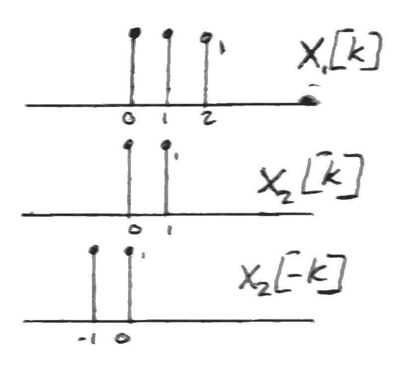
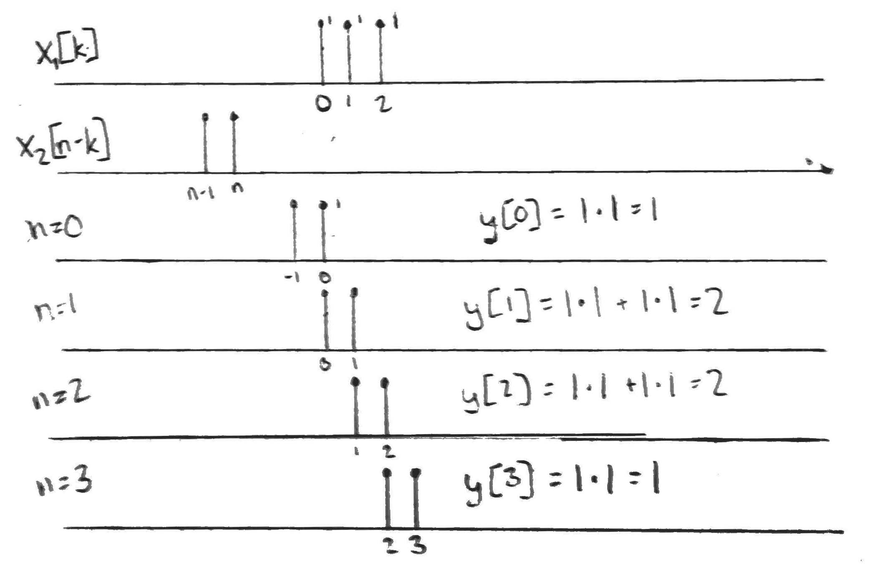

# Lecture 6 - Notes  

**January 15, 2016**  

## Administrative

### Assignment 1

* __2.7)__ Complex exponentials are periodic if $\frac{\omega_0}{2 \pi}$ is rational
* __2.28)__ We are asked with limited information about a system
    * __b)__ Create a linear combination of the input signals that it is the 0 constant signal, i.e., the input is always 0. Check wether the output is 0 or not.
    * __c,d)__ Create linear combinations of the input signals and their time shifted versions.

### Other

* Will be out of class, Dr. Sima will be substituting
* Assignment 2 will be posted Monday

---

## Linear Time Invariant Systems --- Continued

What do we need to know about an LTI system to compute its response to any input signal? In a general way we can represent a discreet signal as,

$$\begin{align}
    x[n] = \sum_{k = -\infty}^{\infty} x[k]\delta[n-k]
\end{align}$$

We know that $h[n]$ (the response to $\delta[n]$), if the system is Linear,

$$\begin{align}
    \underset{x[n]}{\sum_{k = -\infty}^{\infty} x[k]\delta[n-k]} 
    \underset{S}\longrightarrow
    \underset{y[n]}{\sum_{k = -\infty}^{\infty} x[k]h[n-k]}
\end{align}$$

so,

$$\begin{align}
    y[n] = x[n] * h[n]
\end{align}$$

where $*$ is the convolution operation.

## Convolution in Discreet Time

### First Method

The first method is called __scale, shift, stack and add__. Given,

$$\begin{align}
    x_1[n] * x_2[n] &= \sum_{k=-\infty}^{\infty} 
    \underbrace{x_1[n]}_{\text{Scaling factors}}
    \cdot 
    \underbrace{x_2[n - k]}_{\text{Time shifted version of } x_2[n]}
\end{align}$$

We start by sketching $x_1[n]$ and $x_2[n]$, for each discreet signal $p$ in $x_1$ we sum them,

$$\begin{align}
    x_1[n] * x_2[n] = \sum_{q = 0}^{p} x_1[q]x_2[n - q]
\end{align}$$

### Second Method

This is the __flip, shift, multiply and add__ method. This is the discreet time version of the continuous time method of convolution. It computes the are of overlap between one signal and the flipped and shifted version of the other signal. Given $x_1[n]$ and $x_2[n]$,

1. Draw $x_1[k]$ and $x_2[-k]$

2. Slide $x_2[n-k]$  through $x_1[k]$ and calculate the areas

### Third Method

This is the __analytical method__ for solving the convolution. Given,

$$\begin{align}
    x_1[n] &= \left( \frac{3}{4} \right)^n u[n] \newline
    x_2[n] &= u[n]
\end{align}$$

so,

$$\begin{align}
    x_1[n] * x_2[n] &= \sum_{k = -\infty}^{\infty} x_1[n]x_2[n-k] \newline
    &= \sum_{k = -\infty}^{\infty}  
    \left( \frac{3}{4} \right)^n u[n]
    u[n-k] \newline
\end{align}$$

note that $u[k] = 0$ for all $k \lt 0$ and $u[n-k] = 0$ for all $0 \le n \lt k$, so,

$$\begin{align}
    x_1[n] * x_2[n] &= \sum_{k = 0}^{n} \left( \frac{3}{4} \right)^n \newline
    &= \frac{\left( \frac{3}{4} \right)\left(1 - \left( \frac{3}{4} \right)^n \right)}{1 - \left( \frac{3}{4} \right)} \newline
    &= \frac{\left( \frac{3}{4} \right)\left(1 - \left( \frac{3}{4} \right)^n \right)}{\frac{1}{4}} \newline
    &= 3 \left(1 - \left( \frac{3}{4} \right)^n \right) \newline
    &= \left\{
	\begin{array}{ll}
		3 \left(1 - \left( \frac{3}{4} \right)^n \right) & \mbox{if } n \ge 0 \newline
		0 & \mbox{if } n < 0
	\end{array}
\right. \newline
    &= 3 \left(1 - \left( \frac{3}{4} \right)^n \right) u[n] \newline
\end{align}$$

